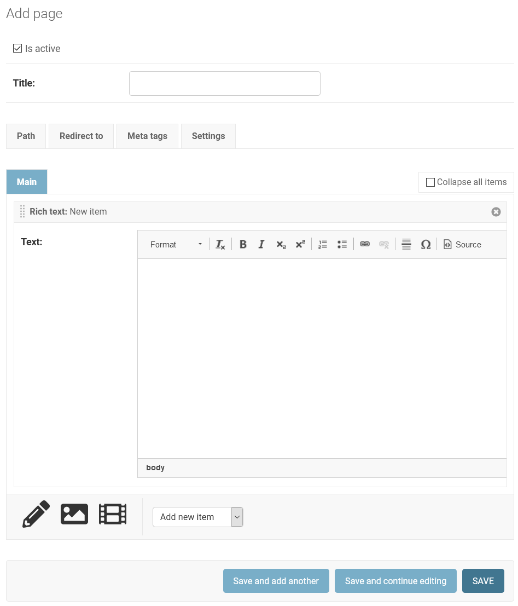

===================================================
django-content-editor -- Editing structured content
===================================================

Version |release|

.. image:: https://travis-ci.org/matthiask/django-content-editor.svg?branch=master
    :target: https://travis-ci.org/matthiask/django-content-editor

**Tagline: The component formerly known as FeinCMS' ItemEditor.**

   The content editing interface.

Django's builtin admin application provides a really good and usable
administration interface for creating and updating content.
``django-content-editor`` extends Django's inlines mechanism with an
interface and tools for managing and rendering heterogenous
collections of content as are often necessary for content management
systems. For example, articles may be composed of text blocks with
images and videos interspersed throughout.

That, in fact, was one of the core ideas of FeinCMS_. Unfortunately,
FeinCMS_ has accumulated much more code than strictly necessary, and
I should have done better in this regard. Of course FeinCMS_ still
contains much less code than `comparable CMS systems`_, but we can do
even better and make it more obvious what's going on.

So, ``django-content-editor``.

.. note::

   If you like these ideas you might want to take a look at feincms3_.

Example: articles with rich text plugins
========================================

First comes a models file which defines a simple article model with
support for adding rich text and download content blocks.

``app/models.py``:

.. code-block:: python

    from django.db import models

    from content_editor.models import Region, create_plugin_base

    class Article(models.Model):
        title = models.CharField(max_length=200)
        pub_date = models.DateField(blank=True, null=True)

        # The ContentEditor requires a "regions" attribute or property
        # on the model. Our example hardcodes regions; if you need
        # different regions depending on other factors have a look at
        # feincms3's TemplateMixin.
        regions = [
            Region(key="main", title="main region"),
            Region(key="sidebar", title="sidebar region"),
        ]

        def __str__(self):
            return self.title

    # create_plugin_base does nothing outlandish, it only defines an
    # abstract base model with the following attributes:
    # - a parent ForeignKey with a related_name that is guaranteed to
    #   not clash
    # - a region CharField containing the region key defined above
    # - an ordering IntegerField for ordering plugin items
    # - a get_queryset() classmethod returning a queryset for the
    #   Contents class and its helpers (a good place to add
    #   select_related and #   prefetch_related calls or anything
    #   similar)
    # That's all. Really!
    ArticlePlugin = create_plugin_base(Article)

    class RichText(ArticlePlugin):
        text = models.TextField(blank=True)

        class Meta:
            verbose_name = "rich text"
            verbose_name_plural = "rich texts"

    class Download(ArticlePlugin):
        file = models.FileField(upload_to="downloads/%Y/%m/")

        class Meta:
            verbose_name = "download"
            verbose_name_plural = "downloads"

Next, the admin integration. Plugins are integrated as
``ContentEditorInline`` inlines, a subclass of ``StackedInline`` that
does not do all that much except serve as a marker that those inlines
should be treated a bit differently, that is, the content blocks should
be added to the content editor where inlines of different types can be
edited and ordered.

``app/admin.py``:

.. code-block:: python

    from django import forms
    from django.contrib import admin
    from django.db import models

    from content_editor.admin import ContentEditor, ContentEditorInline

    from .models import Article, RichText, Download

    class RichTextarea(forms.Textarea):
        def __init__(self, attrs=None):
            # Provide class so that the code in plugin_ckeditor.js knows
            # which text areas should be enhanced with a rich text
            # control:
            default_attrs = {"class": "richtext"}
            if attrs:
                default_attrs.update(attrs)
            super(RichTextarea, self).__init__(default_attrs)

    class RichTextInline(ContentEditorInline):
        model = RichText
        formfield_overrides = {
            models.TextField: {"widget": RichTextarea},
        }
        regions = ["main"]  # We only want rich texts in "main" region.

        class Media:
            js = (
                "//cdn.ckeditor.com/4.5.6/standard/ckeditor.js",
                "app/plugin_ckeditor.js",
            )

    admin.site.register(
        Article,
        ContentEditor,
        inlines=[
            RichTextInline,
            # The create method serves as a shortcut; for quickly
            # creating inlines:
            ContentEditorInline.create(model=Download),
        ],
    )

Here's an example CKEditor integration. Especially noteworthy are the
two signals emitted by the content editor: ``content-editor:activate``
and ``content-editor:deactivate``. Since content blocks can be
dynamically added and ordered using drag-and-drop, most JavaScript
widgets cannot be added only on page load. Also, many widgets do not
like being dragged around and break respectively become unresponsive
when dropped. Because of this you should listen for those signals.

Note that it is *not guaranteed* that the former event is only emitted
once per inline.

``app/static/app/plugin_ckeditor.js``:

.. code-block:: javascript

    /* global django, CKEDITOR */
    (function($) {

        /* Improve spacing */
        var style = document.createElement("style");
        style.type = "text/css";
        style.innerHTML = "div[id*='cke_id_'] {margin-left:170px;}";
        $("head").append(style);

        CKEDITOR.config.width = "787";
        CKEDITOR.config.height= "300";
        CKEDITOR.config.format_tags = "p;h1;h2;h3;h4;pre";
        CKEDITOR.config.toolbar = [[
            "Maximize","-",
            "Format","-",
            "Bold","Italic","Underline","Strike","-",
            "Subscript","Superscript","-",
            "NumberedList","BulletedList","-",
            "Anchor","Link","Unlink","-",
            "Source"
        ]];

        // Activate and deactivate the CKEDITOR because it does not like
        // getting dragged or its underlying ID changed.
        // The "data-processed" attribute is set for compatibility with
        // django-ckeditor. (Respectively to prevent django-ckeditor's
        // ckeditor-init.js from initializing CKEditor again.)

        $(document).on(
            "content-editor:activate",
            function(event, $row, formsetName) {
                $row.find("textarea[data-type=ckeditortype]").each(function() {
                    if (this.getAttribute("data-processed") != "1") {
                        this.setAttribute("data-processed", "1")
                        $($(this).data("external-plugin-resources")).each(function(){
                            CKEDITOR.plugins.addExternal(this[0], this[1], this[2]);
                        });
                        CKEDITOR.replace(this.id, $(this).data("config"));
                    }
                });
            }
        ).on(
            "content-editor:deactivate",
            function(event, $row, formsetName) {
                $row.find("textarea[data-type=ckeditortype]").each(function() {
                    try {
                        CKEDITOR.instances[this.id] && CKEDITOR.instances[this.id].destroy();
                        this.setAttribute("data-processed", "0")
                    } catch(err) {}
                });
            }
        );
    })(django.jQuery);

Here's a possible view implementation:

``app/views.py``:

.. code-block:: python

    from django.shortcuts import get_object_or_404, render
    from django.utils.html import format_html, mark_safe

    from content_editor.contents import contents_for_item

    from .models import Article, RichText, Download

    def render_items(items):
        for item in items:
            if isinstance(item, RichText):
                yield mark_safe(item.text)
            elif isinstance(item, Download):
                yield format_html(
                    '<a href="{}">{}</a>',
                    item.file.url,
                    item.file.name,
                )

    def article_detail(request, id):
        article = get_object_or_404(Article, id=id)
        contents = contents_for_item(article, [RichText, Download])
        return render(request, "app/article_detail.html", {
            "article": article,
            "content": {
                region.key: mark_safe("".join(render_items(contents[region.key])))
                for region in article.regions
            },
        })

.. note::

   The ``TemplatePluginRenderer`` from `feincms3
   <https://feincms3.readthedocs.io/>`__ offers a more flexible and
   capable method of rendering plugins.

After the ``render_regions`` call all that's left to do is add the
content to the template.

``app/templates/app/article_detail.html``:

.. code-block:: html+django

    <article>
        <h1>{{ article }}</h1>
        {{ article.pub_date }}

        {{ content.main }}
    </article>
    <aside>{{ content.sidebar }}</aside>

Finally, ensure that ``content_editor`` and ``app`` are added to your
``INSTALLED_APPS`` setting, and you're good to go.

If you also want nice icons to add new items, you might want to use
`font awesome`_ and the following snippets:

``app/admin.py``:

.. code-block:: python

    from content_editor.admin import ContentEditor, ContentEditorInline
    from js_asset import JS

    # ... the RichTextInline from above

    class ArticleAdmin(ContentEditor):
        inlines = [
            RichTextInline.create(
                button='<i class="fas fa-pencil-alt"></i>',
            ),
            ContentEditorInline.create(
                model=Download,
                button='<i class="fas fa-download"></i>',
            ),
        ]

        class Media:
            js = (
                JS("https://use.fontawesome.com/releases/v5.0.10/js/all.js", {
                    "defer": "defer",
                    "integrity": "sha384-slN8GvtUJGnv6ca26v8EzVaR9DC58QEwsIk9q1QXdCU8Yu8ck/tL/5szYlBbqmS+",  # noqa
                    "crossorigin": "anonymous",
                }, static=False),
            )

Parts
=====

Regions
~~~~~~~

The included ``Contents`` class and its helpers (``contents_*``) and
the ``ContentEditor`` admin class expect a ``regions`` attribute or
property (**not** a method) on their model (the ``Article`` model
above) which returns a list of ``Region`` instances.

Regions have the following attributes:

* ``title``: Something nice, will be visible in the content editor.
* ``key``: The region key, used in the content proxy as attribute name
  for the list of plugins. Must contain a valid Python identifier.
* ``inherited``: Only has an effect if you are using the
  ``inherit_from`` argument to ``contents_for_item``: Model instances
  inherit content from their other instances if a region with
  ``inherited = True`` is empty.

You are free to define additional attributes -- simply pass them
when instantiating a new region.

Templates
~~~~~~~~~

Various classes will expect the main model to have a ``template``
attribute or property which returns a ``Template`` instance.
django-content-editor does not use the template class itself, but
feincms3 includes a mixin which allows content managers to choose from a
selection of templates per model instance.

Templates have the following attributes:

* ``title``: Something nice.
* ``key``: The template key. Must contain a valid Python identifier.
* ``template_name``: A template path.
* ``regions``: A list of region instances.

As with the regions above, you are free to define additional
attributes.

``Contents`` class and helpers
~~~~~~~~~~~~~~~~~~~~~~~~~~~~~~

The ``content_editor.contents`` module offers a few helpers for
fetching content blocks from the database. The ``Contents`` class
knows how to group content blocks by region and how to merge
contents from several main models. This is especially useful in
inheritance scenarious, for example when a page in a hierarchical
page tree inherits some aside-content from its ancestors.

.. note::

   **Historical note**

   The ``Contents`` class and the helpers replace the monolithic
   ``ContentProxy`` concept in FeinCMS_.

Simple usage is as follows:

.. code-block:: python

    from content_editor.contents import Contents

    article = Article.objects.get(...)
    c = Contents(article.regions)
    for item in article.app_richtext_set.all():
        c.add(item)
    for item in article.app_download_set.all():
        c.add(item)

    # Returns a list of all items, sorted by the definition
    # order of article.regions and by item ordering
    list(c)

    # Returns a list of all items from the given region
    c["main"]
    # or
    c.main

    # How many items do I have?
    len(c)

    # Inherit content from the given contents instance if one of my
    # own regions is empty and has its "inherited" flag set.
    c.inherit_regions(some_other_contents_instance)

    # Plugins from unknown regions end up in _unknown_region_contents:
    c._unknown_region_contents

For most use cases you'll probably want to take a closer look at the
following helper methods instead of instantiating a ``Contents`` class
directly:

``contents_for_items``
----------------------

Returns a contents instance for a list of main models:

.. code-block:: python

    articles = Article.objects.all()[:10]
    contents = contents_for_items(
        articles,
        plugins=[RichText, Download],
    )

    something = [
        (article, contents[article])
        for article in articles
    ]

``contents_for_item``
---------------------

Returns the contents instance for a given main model (note that this
helper calls ``contents_for_items`` to do the real work):

.. code-block:: python

    # ...
    contents = contents_for_item(
        article,
        plugins=[RichText, Download],
    )

It is also possible to add additional items for inheriting regions.
This is most useful with a page tree where i.e. sidebar contents are
inherited from ancestors (this example uses methods added by
django-tree-queries_ as used in feincms3_):

.. code-block:: python

    page = ...
    contents = contents_for_item(
        page,
        plugins=[RichText, Download],
        page.ancestors().reverse(),  # Prefer content closer to the
                                     # current page
    )

Design decisions
================

About rich text editors
~~~~~~~~~~~~~~~~~~~~~~~

We have been struggling with rich text editors for a long time. To
be honest, I do not think it was a good idea to add that many
features to the rich text editor. Resizing images uploaded into a
rich text editor is a real pain, and what if you'd like to reuse
these images or display them using a lightbox script or something
similar? You have to resort to writing loads of JavaScript code
which will only work on one browser. You cannot really filter the
HTML code generated by the user to kick out ugly HTML code generated
by copy-pasting from word. The user will upload 10mb JPEGs and
resize them to 50x50 pixels in the rich text editor.

All of this convinced me that offering the user a rich text editor
with too much capabilities is a really bad idea. The rich text
editor in FeinCMS only has bold, italic, bullets, link and headlines
activated (and the HTML code button, because that's sort of
inevitable -- sometimes the rich text editor messes up and you
cannot fix it other than going directly into the HTML code.  Plus,
if someone really knows what they are doing, I'd still like to give
them the power to shot their own foot).

If this does not seem convincing you can always add your own rich
text plugin with a different configuration (or just override the
rich text editor initialization template in your own project). We do
not want to force our world view on you, it's just that we think
that in this case, more choice has the bigger potential to hurt than
to help.

Plugins
~~~~~~~

Images and other media files are inserted via objects; the user can
only select a file and a display mode (f.e. float/block for images
or something...). An article's content could look like this:

* Rich Text
* Floated image
* Rich Text
* YouTube Video Link, embedding code is automatically generated from
  the link
* Rich Text

It's of course easier for the user to start with only a single rich
text field, but I think that the user already has too much confusing
possibilities with an enhanced rich text editor. Once the user
grasps the concept of content blocks which can be freely added,
removed and reordered using drag/drop, I'd say it's much easier to
administer the content of a webpage. Plus, the content blocks can
have their own displaying and updating logic; implementing dynamic
content inside the CMS is not hard anymore, on the contrary. Since
content blocks are Django models, you can do anything you want
inside them.

Glossary
========

- **Main model**: (Bad wording -- not happy with that). The model to
  which plugins may be added. This model uses the content editor
  admin class.

- **Plugin**: A content element type such as rich text, download,
  and image or whatever.

- **Content block**: A content element instance belonging to a main
  model instance. Also called **item** sometimes in the documentation
  above.

.. _Django: https://www.djangoproject.com/
.. _FeinCMS: https://github.com/feincms/feincms/
.. _comparable CMS systems: https://www.djangopackages.com/grids/g/cms/
.. _font awesome: https://fortawesome.github.io/Font-Awesome/
.. _django-tree-queries: https://github.com/matthiask/django-tree-queries/
.. _feincms3: https://feincms3.readthedocs.io/

.. include:: ../CHANGELOG.rst
